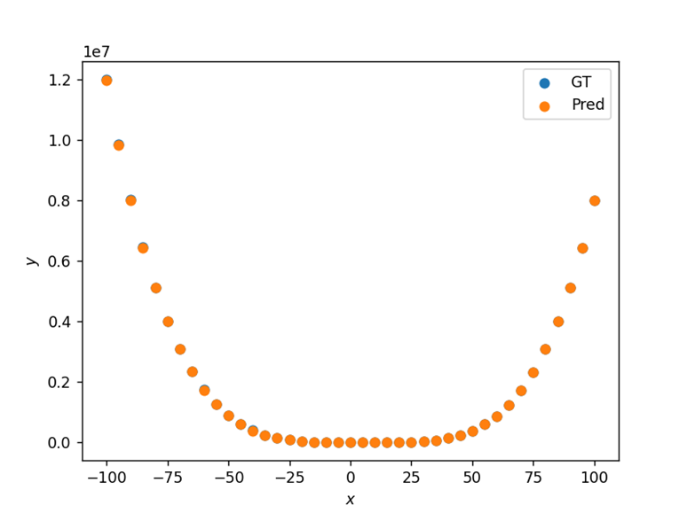
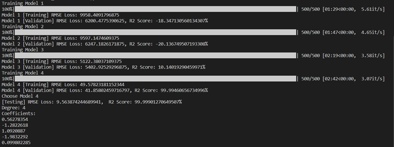

# Polynomial Solver
SGD is an iterative optimization algorithm that is used to find the optimal values for a set of parameters in a model. In this case, the parameters are the coefficients of the polynomial function. The algorithm starts with initial estimates for the coefficients and then iteratively adjusts them based on the error between the predicted values and the actual values of the data points.

Using the SGD in the tinygrad framework (<a href="https://github.com/geohot/tinygrad">https://github.com/geohot/tinygrad</a>), this project aims to estimates the degree and coefficients of a polynomial function that best fits a set of given x and y data points. According to Abel-Ruffini theorem, there is no solution in radicals to general polynomial equations of degree five or higher. Hence, the polynomial models used in this project is limited to degree four and lower.

### Dataset
The provided file data_train.csv and data_test.csv is the dataset used in building the models. The training data is further divided into two: for training and for validation. 80% of the data is used in training, while 20% is used for validation. The validation process is to observe the performance of the model in response to unforeseen data. Moreover, the chosen model from the four trained models is chosen based on the results of the validation, where the one with the lowest loss is used for testing.

### Models
The models trained in the code is the following:
* Model 1: y = ax + b
* Model 2: y = ax2 + bx + c
* Model 3: y = ax3 + bx2 + cx + d
* Model 4: y = ax4 + bx3 + cx2 + dx + e

Where a, b, c, d, and e are all weights. 

### Performance Metrics
* Root Mean Square Error (RMSE): RMSE is a measure of the difference between the predicted values of a model and the actual values. It is calculated as the square root of the average of the squared differences between the predicted and actual values. A lower RMSE value indicates a better fit of the model to the data.
* R2 Score: The R2 score, also known as the coefficient of determination, is a measure of how well the model fits the data. It is calculated as the ratio of the variance of the predicted values to the variance of the actual values. An R2 score of 1 indicates a perfect fit, while a score of 0 indicates that the model does not explain any of the variance in the data.

### Possible User Inputs
* File Location of Train Set (--train_dataset) (str): default='dataset/data_train.csv'
* File Location of Test Set (--test_dataset) (str): default='dataset/data_test.csv'
* Learning Rate (--lr) (float): default=40
* Batch Size (--batch_size) (int): default=0.00000000003
* Maximum Number of Iterations (--max_epoch) (int): default=500

See the argparser in io_handling.py in functions folder for more information.

### Sample Run of solver.py
A couple of test run was conducted to see the performance of the overall project. The following is one of the best results of running the code:

  
   Figure 1. Sample Plot of Ground Truth and Predicted Values.

  
   Figure 2. Performance of the Models.

From Figure 2, the best model for the provided dataset is Model (4th degree polynomial). It has a 49.09 RMSE Training Loss, 45.20 RMSE Validation Loss, almost 100% R2 score in validation, 45.44 RMSE Testing Loss, and 99.98% R2 score in testing. In my personal experience, the RMSE loss for Training and Validation of the best model is around 9-140, while it might even reach 300 for Testing in worst case scenarios.
